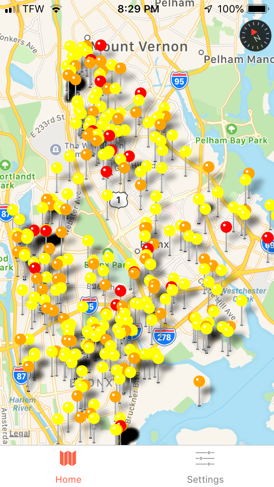

# rnnr-app
React Native App for Rnnr DandyHacks Fall 2018 project.

App was designed for keeping runners safe by informing them of local hazards near where they run. The application was developed
in javascript using [React Native](https://facebook.github.io/react-native/) and the [Expo framework](https://expo.io/).
WIP support for Strava API to inform users of the safety of their runs.

For the web scraping code, please see my teammate's Github repo at [KST123ABE/Rnnr](https://github.com/KST123ABC/Rnnr).
It was implemented in Python using [Beautiful Soup](https://www.crummy.com/software/BeautifulSoup/) and Sqlite3 for the database.

## Screenshot of Map View:

## TODO:
- [ ] Fix bugs with accessing Strava API (currently only successfully grabs user profile picture).
- [ ] Refactor the code to use a state management library such as [Redux](https://redux.js.org/).
- [ ] Add actual testing code :sweat:
- [ ] Consider different hosting strategy for data (right now we just bundle a Sqlite3 database).
- [x] Begin support for Strava API and add Strava OAuth sign in.
- [x] Add navigation for sign in and different views (map view, settings view).
- [x] Different colors for pins according to severity of offense.

